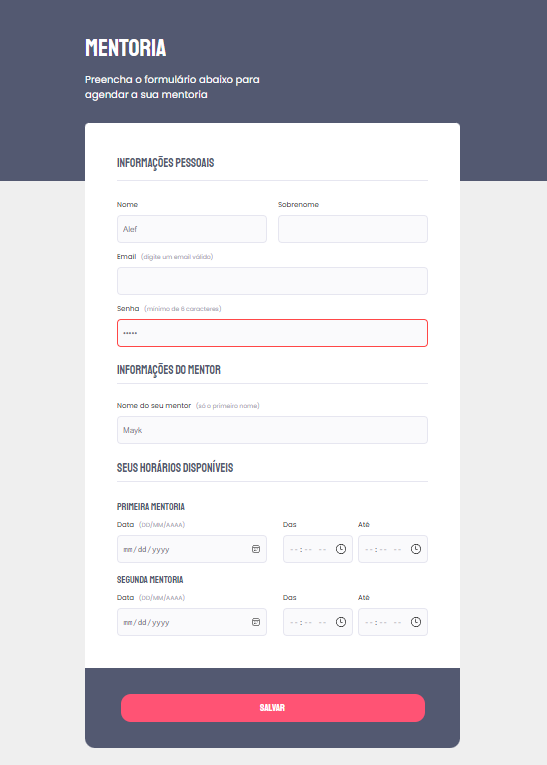

## Creating-Forms-01
<h3 align="center">The objective</h3>

> 

> The idea of creating this form was for further learning, reviewing and applying new concepts
>  
> This form was created from zero based on figma and without consultation
>  
> I tried to be as close as possible to figma
>  
> It was also implemented a better accessibility by darkening what didn't have the ideal contrast when you put the mouse on top of it
>  
> Only one input had minimum mandatory characters and the minlength was added then only on it.
>  
> No input with mandatory requirement added to not mess up the layout too much, but you can get a sense of input:invalid with the minLenght input applied
> 

<h3>Figma</h3>

 

Figma link:	
 	

 
<b>The form was based on this figma project above</b>
 	

<h3 align="center">Created form!</h3>

<h4>Made by</h4>
    

<h3>Alef Warchon</h3>

